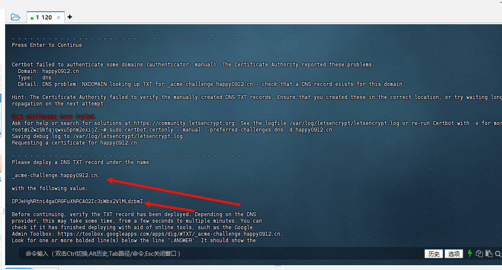
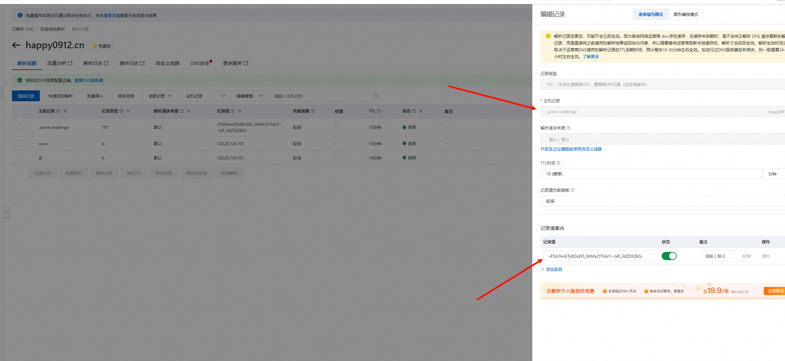

```
# Ubuntu 22.04 LTS

# 移除自带的 certbot
sudo apt-get remove certbot

# 确认 snap 管理器已安装
snap --version

# 按官方建议从 snap 安装 certbot
sudo snap install --classic certbot

# 确认 certbot 安装
certbot --version

# 建立链接
which certbot
sudo ln -s /snap/bin/certbot /usr/bin/certbot

# Confirm plugin containment level:
# Run this command on the command line on the machine to acknowledge that the installed plugin will have the same classic containment as the Certbot snap.
sudo snap set certbot trust-plugin-with-root=ok

# 安装对应的插件
# 腾讯云 dnspod 无支持插件，所以不装


# 创建证书，过程日志记录在 /var/log/letsencrypt/letsencrypt.log
sudo certbot certonly --manual --preferred-challenges dns -d *.yourdomain.com
// `*.yourdomain.com` 表示你的域名

# ...输入 email，再同意一些选项...然后停在手动验证部分

# 根据输出的提示，手动在腾讯云 DNS 配置界面上添加 TXT 验证记录
# 如将 _acme-challenge.yourdomain.com 添加 TXT 类型解析，值为 B8p8l...VkP9E

1. 将这里的值在阿里云 DNS 解析中添加




2. 等待 10 分钟，再执行按回车

# 新开个命令行，检查新加的 DNS TXT 记录是否生效，如果生效应该输出对应的值
dig +nocmd _acme-challenge.yourdomain.com txt +noall +answer

# 回到 certbot 命令行，回车让其继续执行，验证 TXT 记录

# 如果验证成功就会生成泛域名证书相关文件，如
#
# Certificate is saved at: /etc/letsencrypt/live/yourdomain.com/fullchain.pem
# Key is saved at:         /etc/letsencrypt/live/yourdomain.com/privkey.pem
# This certificate expires on 2024-01-30.
# These files will be updated when the certificate renews.


```

# 参考 https://juejin.cn/post/7296404570949386290?searchId=2025090115544829C89C18BCCDB5C830D9
