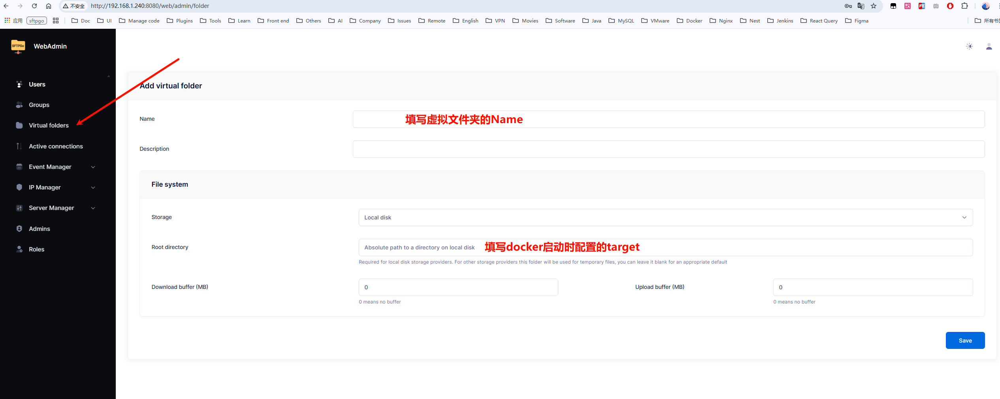
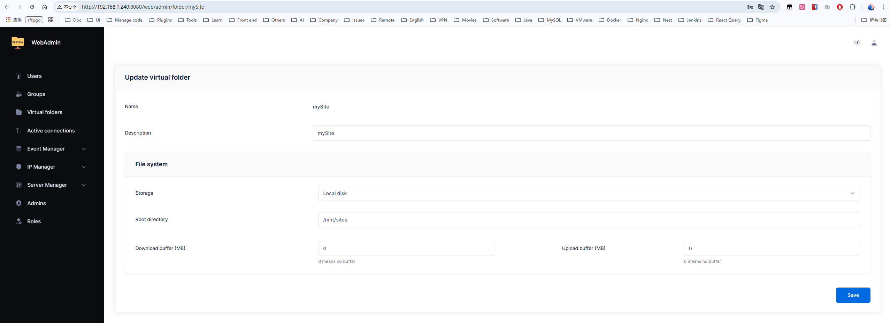
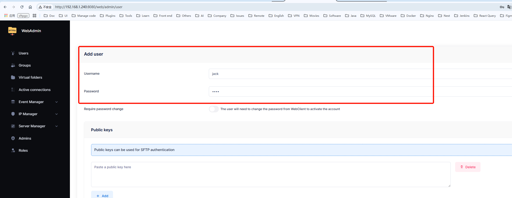
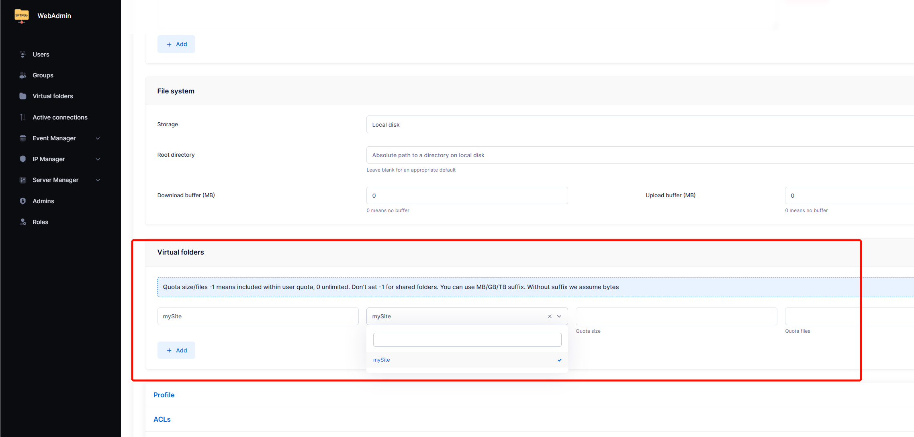
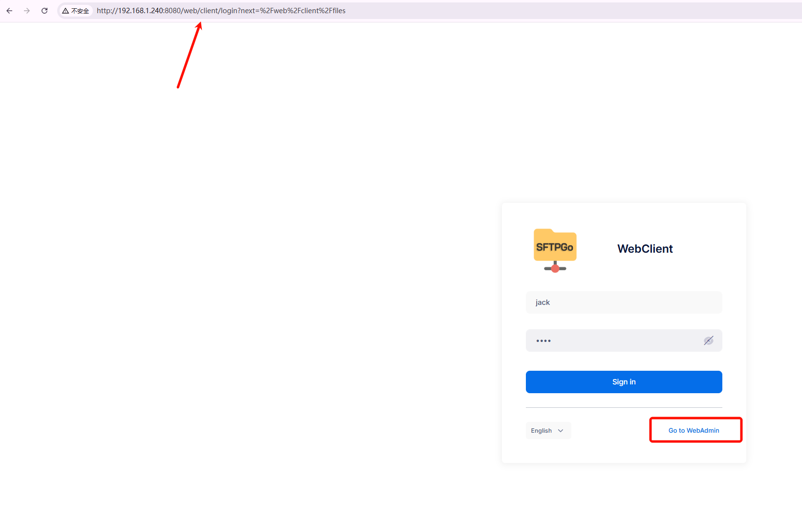
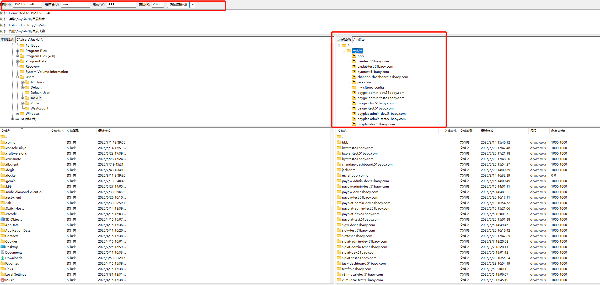
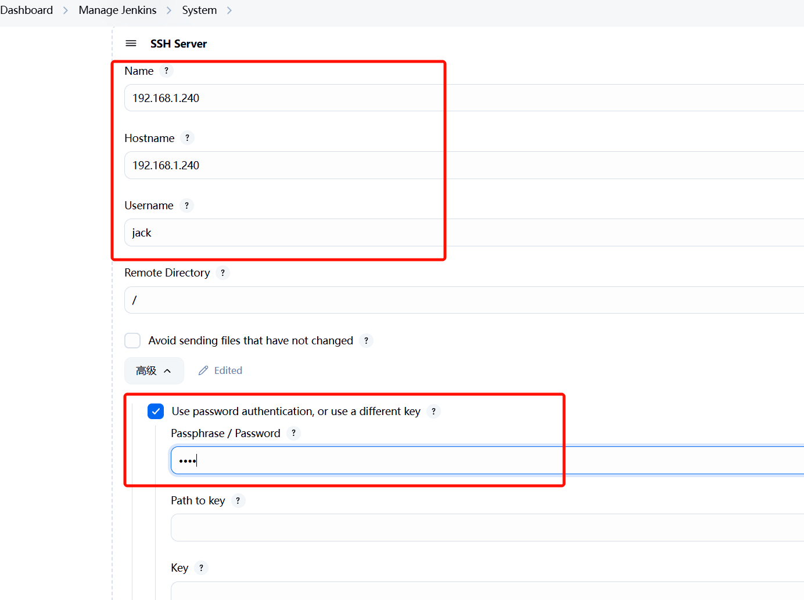
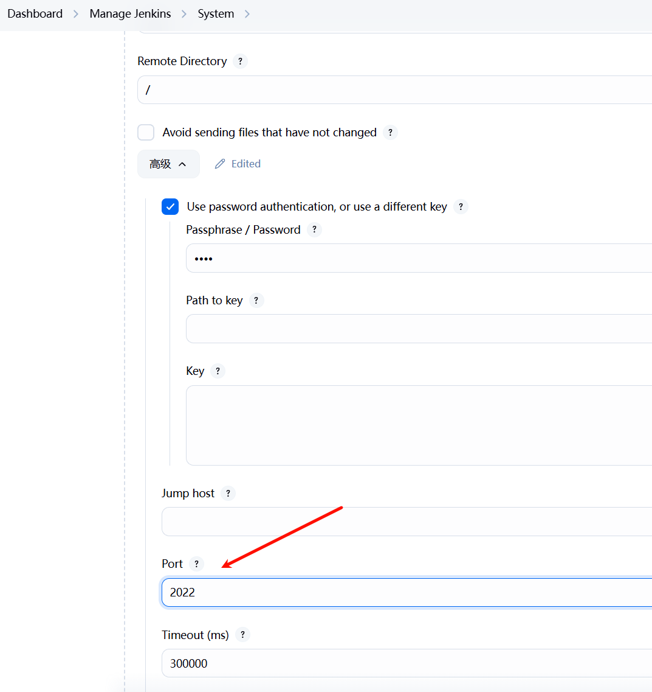

# sftpgo

## Reference

1. [官网](https://docs.sftpgo.com/enterprise/config-file)

## 容器部署

1. 启动容器

   ```
   docker run --name sftpgo \
   -p 8080:8080 \
   -p 2022:2022 \
   --mount type=bind,source=/home/tools/1panel/1panel/apps/openresty/openresty/www/sites,target=/mnt/sites \
   -d swr.cn-north-4.myhuaweicloud.com/ddn-k8s/docker.io/drakkan/sftpgo:2.6.x
   // `8080`, 面板访问地址。如 `http://192.168.1.xxx:8080/web/admin/users` 可以访问面板
   // `2022` sftp端口号
   // `source` 表示sftp可访问的宿主文件夹
   // `target` 表示虚拟文件夹对应的宿主文件夹
   ```

2. 容器启动后，通过 `http://192.168.1.240:8080` 访问面板做对应配置。需要先创建一个超级管理员账号

3. 创建一个虚拟文件夹。通过此虚拟文件夹，就能访问到容器启动时 `source` 所对应的宿主文件夹

   - 
   - 

4. 添加一个用户，并配置该用户可访问的虚拟文件夹

   - 
   - 

5. 切换到用户端，使用新增的用户进行登录

   - 

6. 测试 sftp 连接

   - 

## 待确定

1. 在 1Panel 上添加新的静态网站时，需要执行以下命令修改宿主机目录权限

   ```
   sudo chown -R 1000:1000 /home/tools/1panel/1panel/apps/openresty/openresty/www/sites
   sudo chmod -R 755 /home/tools/1panel/1panel/apps/openresty/openresty/www/sites
   ```

## Jenkins

1. 安装 `Publish Over SSH` 插件

2. 配置用户

   - 
   - 
