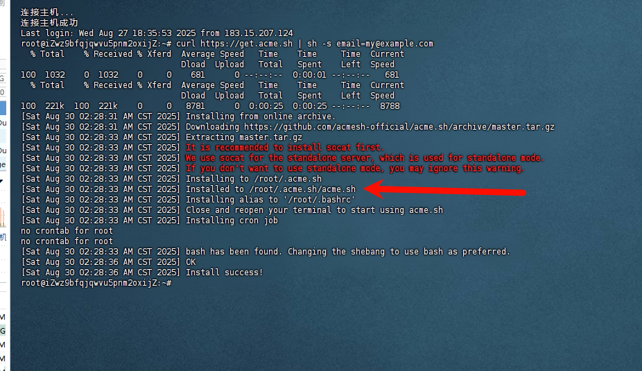

# ssl证书

1. https://github.com/acmesh-official/acme.sh

服务器上操作

1. 输入命令

```
curl https://get.acme.sh | sh -s email=my@example.com
```

2. 记住安装的地址，后面用到

   - `/root/.acme.sh/acme.sh`




3. 输入命令签发证书

```
/root/.acme.sh/acme.sh --issue -d happy0912.cn -d www.happy0912.cn --webroot /var/www/htm
```
