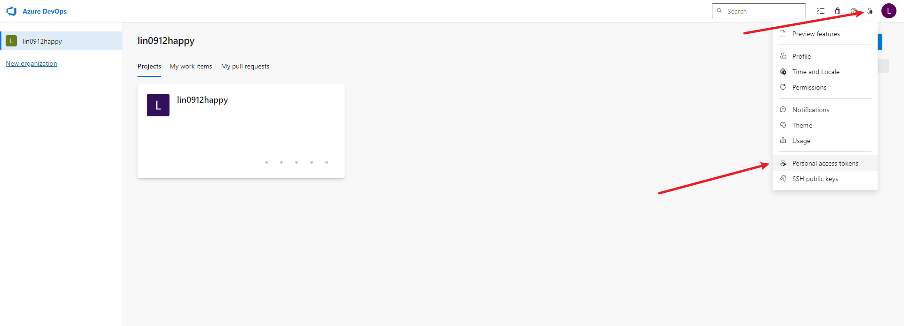
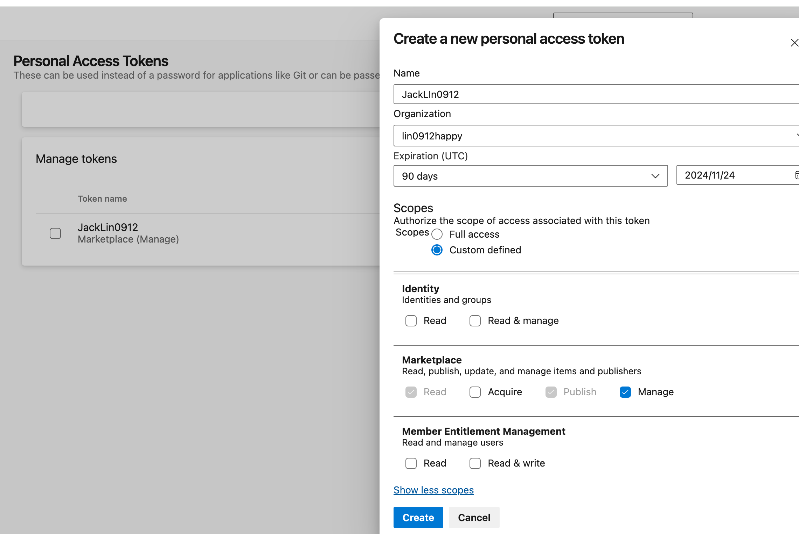
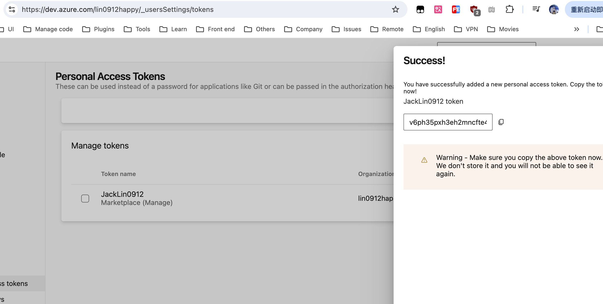
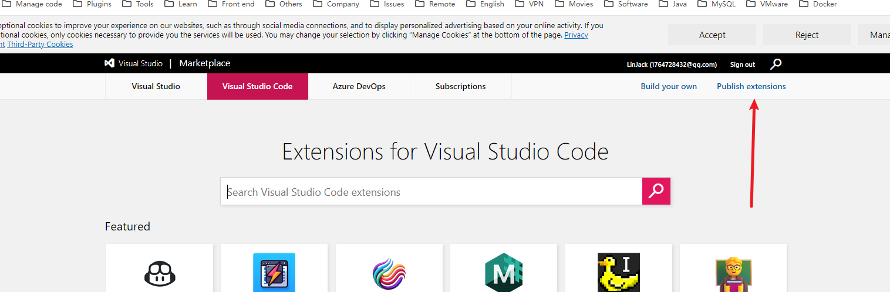
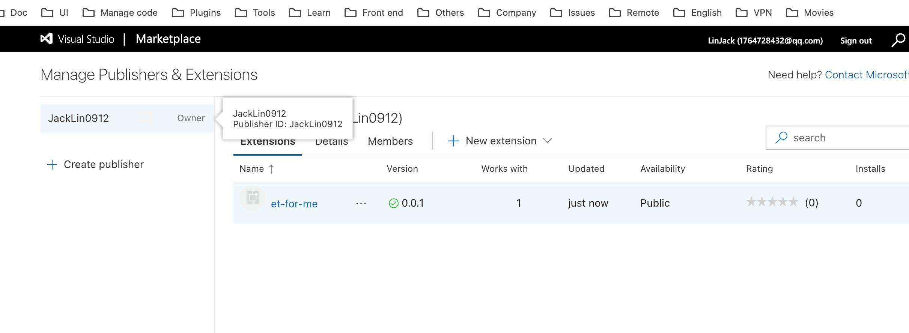

# 开发插件

## 开发

::: tip
最好通过 `npm` 来进行包管理
:::

### 使用官方提供的脚手架构建项目

1. [Your First Extension](https://code.visualstudio.com/api/get-started/your-first-extension)

2. 全局安装脚手架

   ```
   npm install --global yo generator-code
   ```

3. 创建项目

   ```
   yo code
   ```

### 调试

1. 执行 `npm run watch`

2. 在当前 `extension.ts` 文件下按 `F5` 打开调试

## 打包发布

### 前置条件

#### azure 中操作

1. 注册微软账户 [微软账号](https://dev.azure.com)

2. 创建一个组织

3. 在 `User setting` -> `Personal access tokens` -> `New Token`

   - 

4. `Name` 随便填一个(JackLin0912) -> `Scopes` 选项中的 `Marketplace` 必须选择 `Manage`

   - 

5. 此时会得到一个 `token`，记录下来

   - 

#### VSCode 插件市场中操作

1. [VSCode 插件市场](https://marketplace.visualstudio.com/VSCode)

2. 登录后选择 `Publish extension`

   - 

3. 创建一个发布者 `Create Publisher`。里面的信息就是插件市场中所展示的作者信息

   - 

4. 记录 `Publisher` 的 ID 值

   - 

5. 在插件的 `package.json` 文件中设置 `publisher` 字段，填入刚刚记录的 ID 值

   ```
   "publisher": "JackLin0912"
   ```

### 安装打包发布工具

1. 安装 `vsce`

   ```
   npm install -g @vscode/vsce
   ```

2. 登录需要发布的账号

   ::: code-group

   ```bash [Syntax]
   vsce login [token名称，也就是前置条件中的Name值]
   ```

   ```bash [Example]
   vsce login JackLin0912
   ```

   :::

   - 此时需要输入 `token`，填入在前置条件中记录下来的 `token` 值

### 打包发布

1. 打包成 `vsix` 包。如果是直接发布到插件市场，那么就不需要进行打包这一步骤

   ```
   vsce package
   ```

2. 发布到插件市场

   ```
   vsce publish
   ```

3. 发布成功就能在 [VSCode 插件市场](https://marketplace.visualstudio.com/VSCode) 中看到自己的应用了

4. 升级插件

   ```
   vsce publish 1.0.0
   // 设置指定版本号

   vsce publish minor
   // 自动递增一个版本号，如 `1.0.0` -> `1.1.0`

   vsce publish patch
   // 自动递增一个版本号，如 `1.0.0` -> `1.0.1`
   ```

## 参考链接

1. [官方文档](https://code.visualstudio.com/api/working-with-extensions/publishing-extension)

2. [VSCode 插件开发攻略](https://www.cnblogs.com/liuxianan/p/vscode-plugin-overview.html)

2. [如何发布一个 vscode 插件](https://juejin.cn/post/7076649162653040647)

3. [B 站](https://www.bilibili.com/video/BV1bG4y1n78A/?spm_id_from=333.337.search-card.all.click&vd_source=42ac8d16f0df491c6ce0afc21c1143e1)

4. [英汉词典](https://github.com/program-in-chinese/vscode_english_chinese_dictionary)
