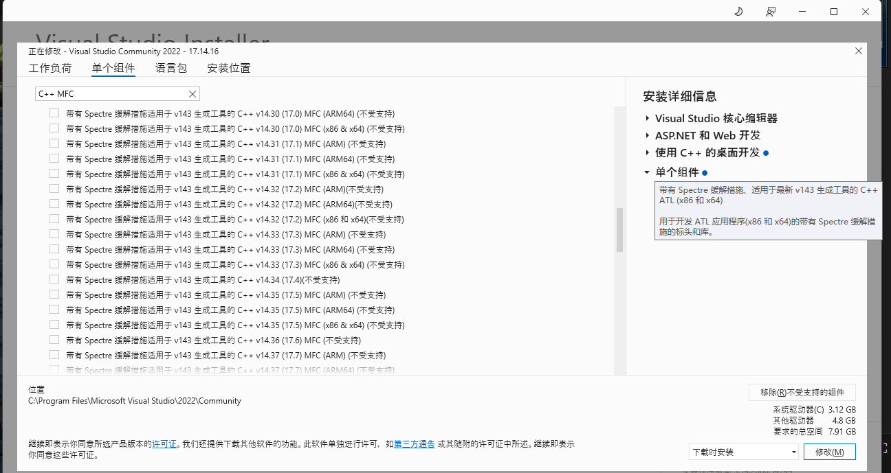
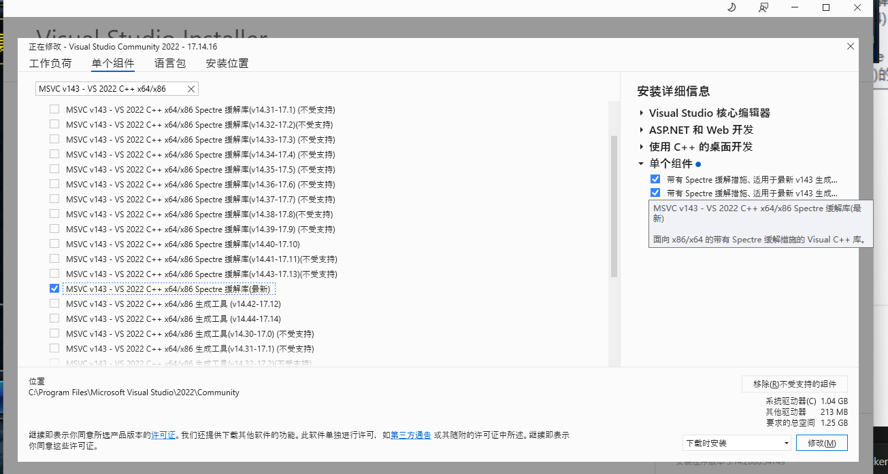
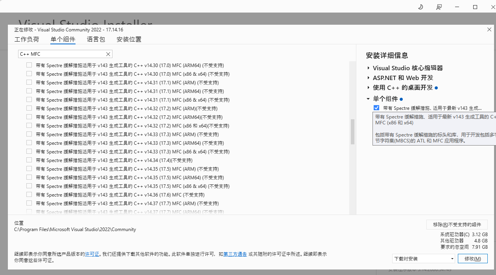

# 源码编译

## 参考链接: https://github.com/microsoft/vscode/wiki/How-to-Contribute


## 步骤

1. 安装对应环境。需要 `Git`, `NodeJs`, `Python`, `C++`

    - `NodeJs` 安装最新版本的 LTS（重要）

    - `Python`。第一个安装页面下方记得勾选添加到环境变量

    - `C++` 环境根据文档安装[ Visual Studio Community Edition](https://visualstudio.microsoft.com/thank-you-downloading-visual-studio/?sku=Community)

        - `MSVC v143 - VS 2022 C++ x64/x86 Spectre-mitigated libs (Latest)`, `C++ ATL for latest build tools with Spectre Mitigations`, `C++ MFC for latest build tools with Spectre Mitigations` 这三个。中文名称对应如下

            - 
            - 
            - 
            - 


2. 进入项目安装依赖

     ```
     npm install
     ```

3. 执行命令，启动桌面端

     ```
     .\scripts\code.bat
     ```
