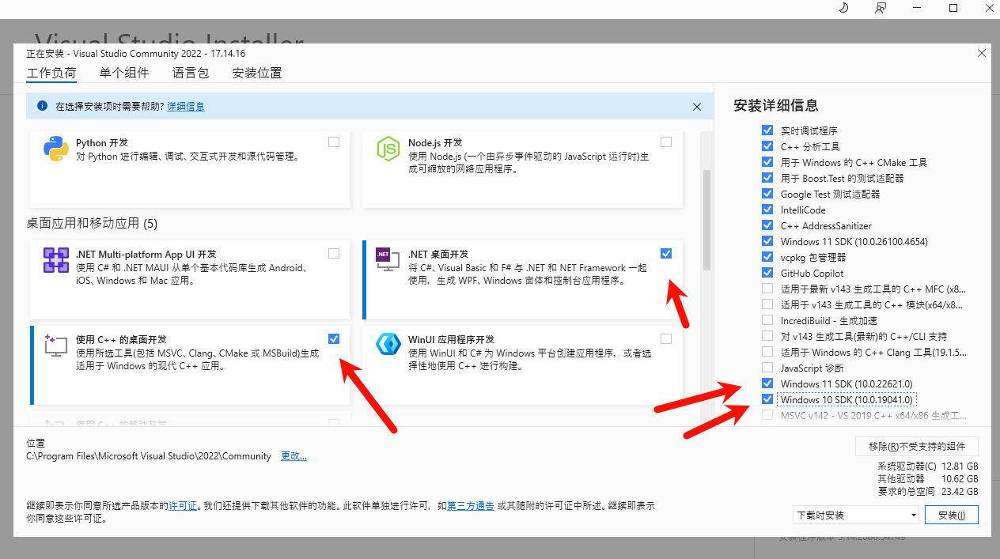
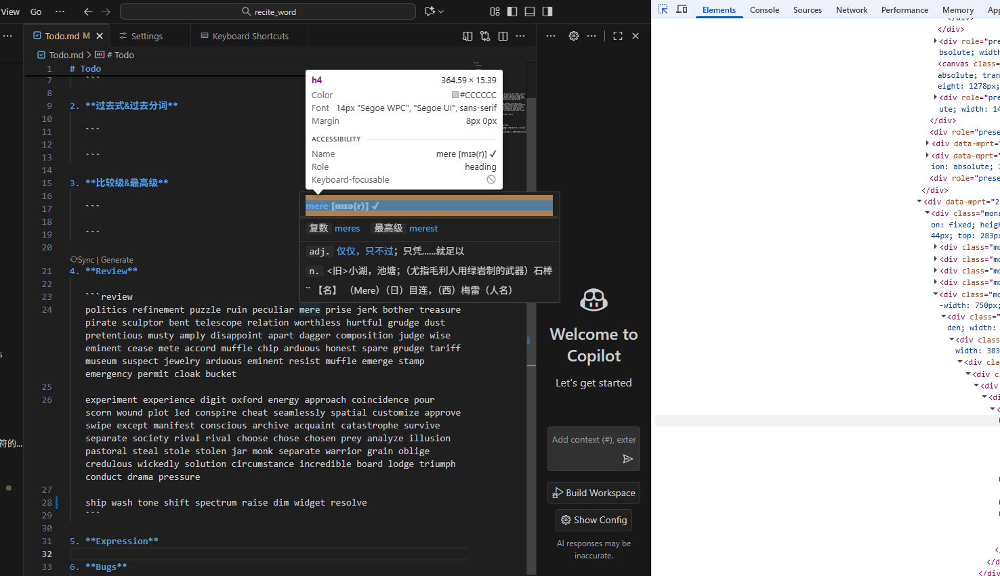

# 源码编译

## 参考链接

    - [官网文档](https://github.com/microsoft/vscode/wiki/How-to-Contribute)

    - [如何从0开始将vscode源码编译、运行、打包桌面APP](https://blog.csdn.net/wanghaoyingand/article/details/145582912)

## 步骤

1. 安装对应环境。需要 `Git`, `NodeJs`, `Python`, `C++`

   - `NodeJs` 安装最新版本的 LTS（重要）

   - `Python`。第一个安装页面下方记得勾选添加到环境变量

   - `C++` 环境根据文档安装[ Visual Studio Community Edition](https://visualstudio.microsoft.com/thank-you-downloading-visual-studio/?sku=Community)

     - `MSVC v143 - VS 2022 C++ x64/x86 Spectre-mitigated libs (Latest)`, `C++ ATL for latest build tools with Spectre Mitigations`, `C++ MFC for latest build tools with Spectre Mitigations` 这三个。中文名称对应如下

       - 
       - 
       - 
       - 
       - 

2. 进入项目安装依赖

   ```
   npm install
   ```

3. 从终端构建，执行后等待控制台出现 `Finished compilation` 提示

   ```
   npm run watch
   ```

   - 

4. 构建成功后，打开另一个终端执行命令，启动桌面端

   ```
   .\scripts\code.bat
   ```

5. 开始调试。`F1` 打开命令面板，输入 `Developer: Toggle Developer Tool`

   - 

6. 和浏览器一样进行调试

   - 
